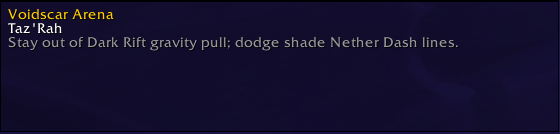
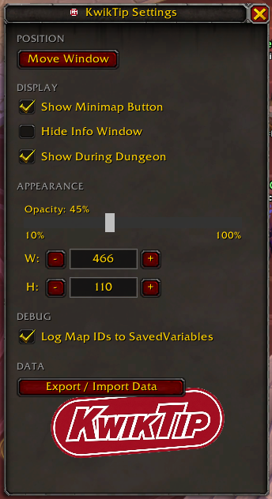

<p align="center">
  
</p>

<p align="center">
  <strong>Version 0.1 — Preview</strong> &nbsp;·&nbsp; WoW: Midnight (Interface 120001)
</p>

A World of Warcraft: Midnight addon that displays contextual tips for dungeons and raids. As your group moves through an instance, KwikTip surfaces relevant boss and trash tips in a small, unobtrusive HUD — no interaction required mid-pull.

> **Note:** KwikTip targets **WoW: Midnight** (Interface 120001). It will not work on live retail or older versions.

Inspired by **QE Dungeon Tips** by QEdev (no longer maintained).

---

## Screenshots

<p align="center">
  
  &nbsp;&nbsp;
  
</p>

---

## Features

- **Boss tips** — concise, actionable guidance for every boss in the Season 1 M+ rotation
- **Trash tips** — tips appear automatically when you target a known notable mob
- **Area-aware HUD** — automatically shows and hides based on whether you're in a supported instance
- **Show During Dungeon** — optionally keep the HUD visible throughout a run, defaulting to the first boss tip when nothing else is active
- **Resizable, draggable HUD** — drag to reposition, drag corners to resize; locks in place when done
- **Position data export/import** — share coordinate data with other users to help build area coverage

---

## Dungeon Coverage

All bosses across all listed dungeons have tips. Trash tips and area-based tip switching are in progress.

### Season 1 Mythic+ Rotation

| Dungeon | Type |
|---|---|
| Windrunner Spire | New — Midnight |
| Maisara Caverns | New — Midnight |
| Magisters' Terrace | New — Midnight (reworked) |
| Nexus-Point Xenas | New — Midnight |
| Algeth'ar Academy | Legacy |
| Pit of Saron | Legacy |
| Seat of the Triumvirate | Legacy |
| Skyreach | Legacy |

### Additional Midnight Dungeons

| Dungeon | Type |
|---|---|
| Murder Row | Level-up (81–88) |
| Den of Nalorakk | Level-up (81–88) |
| The Blinding Vale | Max level |
| Voidscar Arena | Max level |

---

## Installation

1. Download or clone this repository
2. Copy the `KwikTip` folder into your addons directory:
   ```
   World of Warcraft/_retail_/Interface/AddOns/KwikTip
   ```
3. Enable the addon in the WoW character select screen

---

## Usage

| Command | Action |
|---|---|
| `/kwiktip` or `/kwik` | Open/close settings |
| `/kwik move` | Toggle move mode (drag and resize the HUD) |
| `/kwik debug` | Print current instance detection state to chat |
| `/kwik export` | Open the position data export/import dialog |
| `/kwik clearlog` | Clear collected position and mob log data |

The HUD is hidden outside of instances. Use `/kwik move` to show and reposition it at any time.

---

## About

This is a hobby project — I have no Lua experience and it is absolutely vibe coded. I do not pretend to be an expert; this is very much a learning experience. Take it easy on me.
